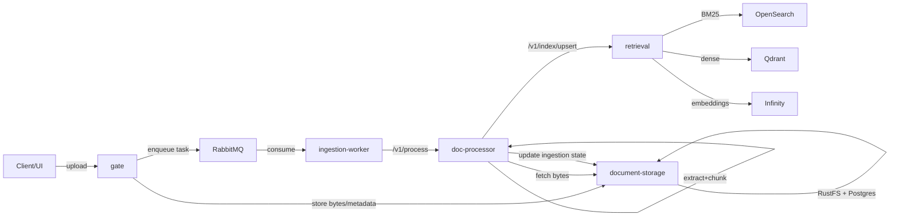
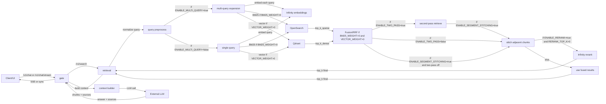

# RAG Experiments Playground

An experimental multi-service RAG (Retrieval-Augmented Generation) stack for exploring state-of-the-art retrieval techniques, stateless microservices architecture, and composable pipelines.

## Overview

This repository implements a full-featured RAG system with:

- **Hybrid Retrieval**: Combines BM25 (sparse) and dense vector search with Reciprocal Rank Fusion (RRF)
- **VLM-Powered Document Processing**: Uses Vision-Language Models (Granite-Docling) for accurate document-to-text extraction
- **Stateless Microservices**: Horizontally scalable services with clear separation of concerns
- **Advanced Features**: Multi-query expansion, two-pass retrieval, reranking, segment stitching, auto-tuning
- **Agentic Search**: Multi-turn research-style queries with streaming responses
- **Full Observability**: Prometheus metrics, Grafana dashboards, structured logging
- **Async Processing**: RabbitMQ-based ingestion pipeline with retry/DLQ

**This project is intentionally experimental** - a sandbox for testing ideas, patterns, and benchmarks rather than a production-ready system. Expect frequent changes as new approaches are explored.

## Quick Start

### Prerequisites

**Required:**
- **Docker** + **Docker Compose v2** (`docker compose ...`)
- At least 8GB RAM available for Docker
- ~20GB disk space for images and volumes

**Optional but Recommended:**
- **NVIDIA GPU** (8GB+ VRAM) for `vllm-docling` VLM-based document extraction
  - Without GPU: Fallback to LibreOffice + PyMuPDF (less accurate for complex PDFs)
- **External LLM API key** (OpenAI, Anthropic, or OpenAI-compatible endpoint) for chat functionality

**Note on Embeddings:**
The default `docker-compose.yml` includes the Infinity embeddings service (BAAI/bge-m3) running on CPU. For GPU acceleration, uncomment the GPU configuration in the infinity service section.

### Installation & Setup

1. **Clone the repository:**
   ```bash
   git clone <your-repo-url>
   cd rag_fun
   ```

2. **Configure environment:**
   ```bash
   cp env.example .env
   # Edit .env to add your LLM API key and endpoint
   nano .env  # or use your preferred editor
   ```

3. **Start all services:**
   ```bash
   docker compose up -d --build
   ```

4. **Wait for services to be ready** (typically 2-3 minutes):
   ```bash
   # Check service health
   curl http://localhost:8090/v1/readyz  # Gate API
   curl http://localhost:8080/v1/readyz  # Retrieval service
   curl http://localhost:9200/_cluster/health  # OpenSearch
   curl http://localhost:6333/health  # Qdrant
   ```

5. **Access the UI:**
   - **Web UI**: http://localhost:3300
   - **Gateway API**: http://localhost:8090
   - **Grafana Dashboards**: http://localhost:3000 (admin/admin)
   - **Prometheus**: http://localhost:9090
   - **RabbitMQ Management**: http://localhost:15672 (guest/guest)

### Quick Test

Upload a document and query it:

```bash
# Upload a document
curl -X POST http://localhost:8090/v1/documents/upload \
  -F "file=@/path/to/your/document.pdf" \
  -F "filename=test.pdf"

# Wait for ingestion to complete (check status)
curl http://localhost:8090/v1/documents/{doc_id}/status

# Query the document
curl -X POST http://localhost:8090/v1/chat \
  -H "Content-Type: application/json" \
  -d '{"query": "What is this document about?", "stream": false}'
```

## Architecture

### System Components

The system consists of **8 microservices** organized into application, ML, and infrastructure layers:

#### Application Services
- **rag-gate** (`:8090`) - FastAPI gateway; orchestrates uploads, chat, and streaming responses
- **retrieval** (`:8080`) - Hybrid search engine (BM25 + vectors); stateless and horizontally scalable
- **document-storage** (`:8081`) - Stores document bytes (S3-compatible) and metadata (Postgres)
- **doc-processor** (`:8082`) - Async worker for document extraction, chunking, and indexing
- **agent-search** (`:8091`) - Agentic multi-turn research queries with execution traces
- **ui** (`:3300`) - Nginx-served SPA with SSE streaming support

#### ML/Embedding Services
- **infinity** (`:7997`) - BAAI/bge-m3 multilingual embeddings (1024-dim, 100+ languages)
- **infinity-rerank** (`:7998`) - BAAI/bge-reranker-v2-m3 cross-encoder reranking
- **vllm-docling** (`:8123`) - IBM Granite-Docling-258M VLM for document extraction
- **vllm-ministral-router** (`:8112`) - Optional query router for auto-tuning retrieval

#### Infrastructure
- **OpenSearch** (`:9200`) - BM25 sparse retrieval and chunk storage
- **Qdrant** (`:6333`) - Dense vector database with HNSW indexing
- **Postgres** (`:5433`) - Document metadata and ingestion state
- **RustFS** (`:9000`) - S3-compatible object storage
- **RabbitMQ** (`:5672`) - Async task queue with DLQ
- **Prometheus** (`:9090`) - Metrics collection
- **Grafana** (`:3000`) - Visualization dashboards

### Data Flows

**Upload → Index:**
1. User uploads document via UI/API
2. Gate stores in document-storage (Postgres + S3)
3. Gate enqueues async task to RabbitMQ
4. Doc-processor extracts text (VLM or fast-path), chunks, and indexes
5. Retrieval service stores chunks in OpenSearch (BM25) and Qdrant (vectors)

**Query → Answer:**
1. User sends chat query via UI
2. Gate calls retrieval service for hybrid search
3. Retrieval combines BM25 + vector results with RRF fusion
4. Optional reranking via infinity-rerank
5. Gate builds LLM context and calls external LLM
6. Streaming response via SSE or synchronous JSON

### Key Features

- **Hybrid Retrieval**: BM25 (OpenSearch) + Dense Vectors (Qdrant) with RRF fusion
- **Advanced Retrieval**: Multi-query expansion, two-pass retrieval, segment stitching
- **VLM Extraction**: High-accuracy document-to-text via Vision-Language Models
- **Async Ingestion**: RabbitMQ-based pipeline with retry and dead-letter queue
- **Streaming Chat**: Server-Sent Events (SSE) for real-time responses
- **Agentic Search**: Multi-turn research queries with execution trace display
- **Auto-Tuning**: Optional LLM-based parameter optimization via router
- **Full Observability**: Prometheus metrics, Grafana dashboards, structured logs

## Current Direction

- ✅ Hybrid retrieval (BM25 + vectors) with RRF fusion
- ✅ VLM-based document extraction (Granite-Docling)
- ✅ Agentic search with streaming and traces
- ✅ Advanced retrieval features (multi-query, two-pass, reranking)
- ✅ Full observability stack (Prometheus, Grafana, structured logging)
- 🔄 Exploring GraphRAG approaches and continuous knowledge graph updates
- 🔄 Benchmarking with BRIGHT, T²-RAGBench, and custom datasets

## Planned Work

- **GraphRAG Integration**: Optional continuous GraphRAG workflow (inspired by zepgraph)
- **Benchmark Expansion**: Add T²-RAGBench and other academic RAG benchmarks
- **Pipeline Comparison**: Systematic evaluation of different retrieval strategies
- **Multi-Modal Support**: Image and table extraction from documents
- **Advanced Chunking**: Semantic chunking, document structure-aware splitting
- **Query Analysis**: Query classification, intent detection, parameter prediction

## Development

### Running Services Locally

For faster iteration, you can run individual services locally while keeping infrastructure in Docker:

```bash
# Start only infrastructure services
docker compose up -d opensearch qdrant postgres rustfs rabbitmq prometheus grafana

# Run retrieval service locally
cd service
pip install -r requirements.txt
python -m app.main

# Run gate locally
cd gate
pip install -r requirements.txt
python -m app.main
```

### Making Changes

**Adding retrieval features:**
- Modify `service/app/indexing_logic.py` (search/index logic)
- Update `service/app/fusion.py` (RRF fusion and reranking)

**Changing chunking:**
- Update `service/app/chunking.py` or `doc-processor/app/chunker.py`

**Adding API endpoints:**
- Update `gate/app/router.py` for new routes
- Modify respective service `main.py` files

**Modifying embeddings:**
- Change `service/app/clients/__init__.py` for embedding integrations

### Testing

**Run E2E tests:**
```bash
cd pipeline-tests
pytest tests/
```

**Run BRIGHT benchmark:**
```bash
cd pipeline-tests/bench
python bright_eval.py --config config.yaml
```

**Evaluate on custom dataset:**
```bash
./run_dataset_evals.sh
```

### Monitoring & Debugging

**View logs:**
```bash
docker compose logs -f <service-name>
docker compose logs -f gate retrieval doc-processor  # Multiple services
```

**Check metrics:**
- Prometheus: http://localhost:9090
- Grafana: http://localhost:3000 (pre-configured dashboards)
- Service metrics: `curl http://localhost:<port>/metrics`

**RabbitMQ queue inspection:**
- Management UI: http://localhost:15672 (guest/guest)
- Check queue depth, message rates, DLQ

## API Reference

### Document Management

**Upload Document:**
```bash
POST /v1/documents/upload
Content-Type: multipart/form-data

file: <binary>
filename: <string>
```

**List Documents:**
```bash
GET /v1/documents
```

**Get Document Status:**
```bash
GET /v1/documents/{doc_id}/status
Response: {
  "doc_id": "...",
  "state": "completed",  # pending | processing | completed | failed
  "stage": "indexing",   # queued | extracting | chunking | indexing
  "indexed": true
}
```

**Delete Document:**
```bash
DELETE /v1/documents/{doc_id}
```

### Chat & Search

**Chat (Synchronous):**
```bash
POST /v1/chat
Content-Type: application/json

{
  "query": "What is the main topic?",
  "top_k": 10,
  "enable_rerank": true
}
```

**Chat (Streaming):**
```bash
POST /v1/chat/stream
Content-Type: application/json

{
  "query": "Explain the architecture",
  "stream": true
}

Response: Server-Sent Events (SSE)
```

**Hybrid Search:**
```bash
POST /v1/search
Content-Type: application/json

{
  "query": "machine learning",
  "top_k": 10,
  "bm25_weight": 0.5,
  "vector_weight": 0.5,
  "enable_rerank": true
}
```

### Agent Search

**Agentic Search:**
```bash
POST /agent/search
Content-Type: application/json

{
  "query": "Research the benefits of hybrid retrieval",
  "stream": true
}

Response: SSE with execution traces
```

## Configuration

### Environment Variables

Key variables in `.env`:

```bash
# LLM Configuration
LLM_ENDPOINT=https://api.openai.com/v1
LLM_API_KEY=sk-...
LLM_MODEL=gpt-4

# Retrieval Configuration
TOP_K=10
BM25_WEIGHT=0.5
VECTOR_WEIGHT=0.5
ENABLE_RERANK=true
RERANK_TOP_K=20

# Chunking
CHUNK_TOKEN_SIZE=512
CHUNK_OVERLAP=50

# Advanced Features
ENABLE_MULTI_QUERY=false
ENABLE_TWO_PASS=false
ENABLE_SEGMENT_STITCHING=true
ENABLE_ROUTER=false

# Worker Configuration
WORKER_CONCURRENCY=1
DOCLING_TIMEOUT=300
```

See `env.example` for full list of configuration options.

### Scaling Services

To scale stateless services:

```bash
docker compose up -d --scale retrieval=3 --scale doc-processor=2
```

Services that scale horizontally:
- `retrieval` - For higher query throughput
- `doc-processor` - For faster ingestion
- `gate` - For more concurrent users (add load balancer)

## Documentation

- **[AGENTS.md](./AGENTS.md)** - Comprehensive guide for developers and AI agents
- **[docs/ARCHITECTURE.md](./docs/ARCHITECTURE.md)** - System architecture deep dive
- **[docs/DATAFLOW.md](./docs/DATAFLOW.md)** - API flows with Mermaid diagrams
- **[docs/TESTING_AND_BENCHMARKS.md](./docs/TESTING_AND_BENCHMARKS.md)** - Testing and benchmark guides
- **[docs/PLANNED_ARCHITECTURE.md](./docs/PLANNED_ARCHITECTURE.md)** - Future improvements

## Technology Stack

| Component | Technology |
|-----------|------------|
| API Framework | FastAPI (Python 3.11) |
| Sparse Retrieval | OpenSearch (BM25) |
| Dense Retrieval | Qdrant (HNSW) |
| Embeddings | BAAI/bge-m3 (1024-dim, multilingual) |
| Reranking | BAAI/bge-reranker-v2-m3 |
| VLM (OCR) | IBM Granite-Docling-258M |
| Database | Postgres 16 |
| Object Storage | RustFS (S3-compatible) |
| Message Queue | RabbitMQ |
| Monitoring | Prometheus + Grafana |
| Deployment | Docker Compose |

## Troubleshooting

### Documents not appearing in search

1. Check ingestion status: `GET /v1/documents/{doc_id}/status`
2. Verify indexing: `POST /v1/index/exists`
3. Check worker logs: `docker compose logs doc-processor`
4. Inspect RabbitMQ queue: http://localhost:15672

### Slow queries

1. Check Prometheus metrics for bottlenecks
2. Reduce `top_k` or disable reranking temporarily
3. Monitor embedding service latency
4. Check OpenSearch heap usage

### VLM extraction failures

1. Verify GPU availability: `docker compose logs vllm-docling`
2. Check timeout settings: `DOCLING_TIMEOUT`
3. Monitor vLLM service health: `curl http://localhost:8123/health`

For detailed troubleshooting, see [AGENTS.md - Debug Checklist](./AGENTS.md#debug-checklist).

## Status

**Current Status:** Active Development

- ✅ Core hybrid retrieval pipeline functional
- ✅ VLM-based document processing working
- ✅ Agentic search implemented
- ✅ Full monitoring stack deployed
- 🔄 Exploring GraphRAG integration
- 🔄 Expanding benchmark coverage

**Stability:** Experimental - expect breaking changes as new approaches are tested.

## Contributing

This is primarily a research and experimentation project. If you're interested in contributing:

1. Open an issue to discuss significant changes
2. Focus on experimental features, new retrieval techniques, or benchmark improvements
3. Maintain the stateless architecture principles
4. Add tests for new features when applicable

## License

[Add your license here]

## Acknowledgements

Built with:
- [BAAI/bge-m3](https://huggingface.co/BAAI/bge-m3) - Multilingual embeddings
- [BAAI/bge-reranker-v2-m3](https://huggingface.co/BAAI/bge-reranker-v2-m3) - Reranking model
- [IBM Granite-Docling](https://huggingface.co/ibm-granite/granite-docling) - Document VLM
- [OpenSearch](https://opensearch.org/) - Search and analytics
- [Qdrant](https://qdrant.tech/) - Vector database
- [FastAPI](https://fastapi.tiangolo.com/) - Modern Python web framework

Inspired by:
- [LightRAG](https://github.com/HKUDS/LightRAG) - Graph-based RAG
- [R2R](https://github.com/SciPhi-AI/R2R) - Production RAG framework
- Various SOTA RAG techniques from recent research

## Dataflow Diagrams

### Ingestion Flow



### Retrieval Flow


