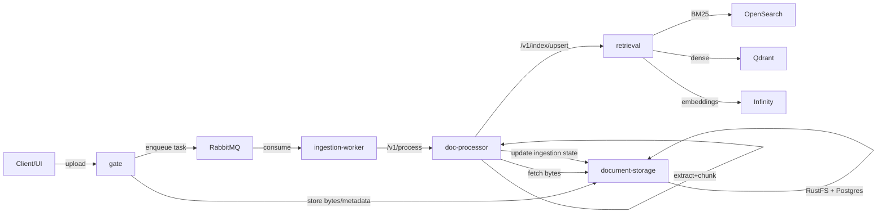
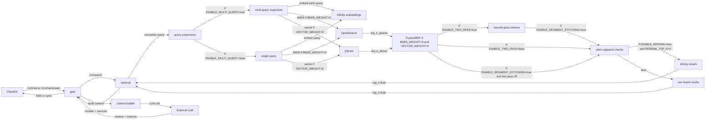

# RAG Experiments Playground

An experimental multi-service RAG (Retrieval-Augmented Generation) stack for exploring state-of-the-art retrieval techniques, stateless microservices architecture, and composable pipelines.

## Overview

This repository implements a full-featured RAG system with:

- **Hybrid Retrieval**: Combines BM25 (sparse) and dense vector search with Reciprocal Rank Fusion (RRF)
- **VLM-Powered Document Processing**: Uses Vision-Language Models (Granite-Docling) for accurate document-to-text extraction
- **Stateless Microservices**: Horizontally scalable services with clear separation of concerns
- **Agent-Search**: LLM-driven retrieval (plan, HyDE, fact queries, retry)
- **Advanced Features**: Multi-query expansion, two-pass retrieval, reranking, segment stitching, auto-tuning
- **Full Observability**: Prometheus metrics, Grafana dashboards, structured logging
- **Async Processing**: RabbitMQ-based ingestion pipeline with retry/DLQ

**This project is intentionally experimental** - a sandbox for testing ideas, patterns, and benchmarks rather than a production-ready system. Expect frequent changes as new approaches are explored.

## Quick Start

### Prerequisites

**Required:**
- **Docker** + **Docker Compose v2** (`docker compose ...`)
- At least 8GB RAM available for Docker
- ~20GB disk space for images and volumes

**Optional but Recommended:**
- **NVIDIA GPU** (8GB+ VRAM) for `vllm-docling` VLM-based document extraction
  - Without GPU: Fallback to LibreOffice + PyMuPDF (less accurate for complex PDFs)
- **External LLM API key** (OpenAI, Anthropic, or OpenAI-compatible endpoint) for chat functionality

**Note on Embeddings:**
The default `docker-compose.yml` includes the Infinity embeddings service (BAAI/bge-m3) running on CPU. For GPU acceleration, uncomment the GPU configuration in the infinity service section.

### Installation & Setup

1. **Clone the repository:**
   ```bash
   git clone <your-repo-url>
   cd rag_fun
   ```

2. **Configure environment:**
   ```bash
   cp env.example .env
   # Edit .env to add your LLM API key and endpoint
   nano .env  # or use your preferred editor
   ```

3. **Start all services:**
   ```bash
   docker compose up -d --build
   ```
   With agent-search and/or deep-research:
   ```bash
   docker compose --profile agent-search up -d --build
   docker compose --profile deep-research up -d --build   # optional: iterative research reports
   ```

4. **Wait for services to be ready** (typically 2-3 minutes):
   ```bash
   # Check service health
   curl http://localhost:8092/v1/readyz  # Gate API
   curl http://localhost:8080/v1/readyz  # Retrieval service
   curl http://localhost:9200/_cluster/health  # OpenSearch
   curl http://localhost:6333/health  # Qdrant
   ```

5. **Access the UI:**
   - **Web UI**: http://localhost:3301
   - **Gateway API**: http://localhost:8092
   - **Grafana Dashboards**: http://localhost:3000 (admin/admin)
   - **Prometheus**: http://localhost:9090
   - **RabbitMQ Management**: http://localhost:15672 (guest/guest)

### Quick Test

Upload a document and query it:

```bash
# Upload a document (Gate on 8092 in this setup)
curl -X POST http://localhost:8092/v1/documents/upload \
  -F "file=@/path/to/your/document.pdf" \
  -F "filename=test.pdf"

# Wait for ingestion to complete (check status)
curl http://localhost:8092/v1/documents/{doc_id}/status

# Query the document
curl -X POST http://localhost:8092/v1/chat \
  -H "Content-Type: application/json" \
  -d '{"query": "What is this document about?", "stream": false}'
```

## Architecture

### System Components

The system consists of **8 microservices** organized into application, ML, and infrastructure layers:

#### Application Services
- **rag-gate** (`:8092`) - FastAPI gateway; orchestrates uploads, chat, and streaming responses (internal port `:8090`)
- **retrieval** (`:8085`) - Hybrid search engine (BM25 + vectors); stateless and horizontally scalable (internal port `:8080`)
- **document-storage** (`:8081`) - Stores document bytes (S3-compatible) and metadata (Postgres)
- **doc-processor** (`:8082`) - Async worker for document extraction, chunking, and indexing
- **agent-search** (`:8093`, profile `agent-search`) - LLM-driven search: plan, HyDE, fact queries, retry
- **deep-research** (`:8094`, profile `deep-research`) - LangGraph-based iterative research: plan → scope → research loop → streaming report
- **ui** (`:3301`) - Nginx-served SPA with SSE streaming support

#### ML/Embedding Services
- **infinity** (`:7997`) - BAAI/bge-m3 multilingual embeddings (1024-dim, 100+ languages)
- **infinity-rerank** (`:7998`) - BAAI/bge-reranker-v2-m3 cross-encoder reranking
- **vllm-docling** (`:8123`) - IBM Granite-Docling-258M VLM for document extraction
- **vllm-ministral-router** (`:8112`) - Optional query router for auto-tuning retrieval

#### Infrastructure
- **OpenSearch** (`:9200`) - BM25 sparse retrieval and chunk storage
- **Qdrant** (`:6333`) - Dense vector database with HNSW indexing
- **Postgres** (`:5433`) - Document metadata and ingestion state
- **RustFS** (`:9000`) - S3-compatible object storage
- **RabbitMQ** (`:5672`) - Async task queue with DLQ
- **Prometheus** (`:9090`) - Metrics collection
- **Grafana** (`:3000`) - Visualization dashboards

### Data Flows

**Upload → Index:**
1. User uploads document via UI/API
2. Gate stores in document-storage (Postgres + S3)
3. Gate enqueues async task to RabbitMQ
4. Doc-processor extracts text (VLM or fast-path), chunks, and indexes
5. Retrieval service stores chunks in OpenSearch (BM25) and Qdrant (vectors)

**Query → Answer:**
1. User sends chat query via UI
2. Gate calls retrieval service for hybrid search
3. Retrieval combines BM25 + vector results with RRF fusion
4. Optional reranking via infinity-rerank
5. Gate builds LLM context and calls external LLM
6. Streaming response via SSE or synchronous JSON

### Key Features

- **Hybrid Retrieval**: BM25 (OpenSearch) + Dense Vectors (Qdrant) with RRF fusion
- **Advanced Retrieval**: Multi-query expansion, two-pass retrieval, segment stitching
- **VLM Extraction**: High-accuracy document-to-text via Vision-Language Models
- **Async Ingestion**: RabbitMQ-based pipeline with retry and dead-letter queue
- **Streaming Chat**: Server-Sent Events (SSE) for real-time responses
- **Auto-Tuning**: Optional LLM-based parameter optimization via router
- **Full Observability**: Prometheus metrics, Grafana dashboards, structured logs

### Agent-Search

LLM-driven search (profile `agent-search`): plan → Gate.chat → quality check → fact queries → answer, with optional web search.

| Service | Port | Description |
|---------|------|-------------|
| **agent-search** | 8093 | Plan → Gate.chat → quality check → fact queries → answer (optional web search, citation [1][2]) |

**Features:** Web search (Serper/Tavily), per-request limits (`max_llm_calls`, `max_fact_queries`), feature flags (`use_hyde`, `use_fact_queries`, `use_retry`), mode presets (`minimal`/`conservative`/`aggressive`), Prometheus metrics.

See **[docs/AGENT_SEARCH.md](./docs/AGENT_SEARCH.md)** for API reference and configuration.

## Current Direction

- Hybrid retrieval (BM25 + vectors) with RRF fusion
- VLM-based document extraction (Granite-Docling)
- SOTA: semantic chunking, contextual headers, local reranker
- Multi-query, two-pass retrieval, reranking
- Observability: Prometheus, Grafana, structured logging
- BRIGHT chunk tuning: `scripts/bright_tune_chunking.py` (full benchmark: `--splits all --eval-splits all --docs-from-gold 100000`). Default chunking: **semchunk** 512/50 in `docker-compose.yml`; for **semantic** 512/50 use `docker-compose-semantic.yml` override.
- Exploring GraphRAG, T²-RAGBench and custom benchmarks

## Planned Work

- **GraphRAG Integration**: Optional continuous GraphRAG workflow (inspired by zepgraph)
- **Benchmark Expansion**: Add T²-RAGBench and other academic RAG benchmarks
- **Pipeline Comparison**: Systematic evaluation of different retrieval strategies
- **Multi-Modal Support**: Image and table extraction from documents
- **Advanced Chunking**: Semantic chunking, document structure-aware splitting
- **Query Analysis**: Query classification, intent detection, parameter prediction

## Development

### Running Services Locally

For faster iteration, you can run individual services locally while keeping infrastructure in Docker:

```bash
# Start only infrastructure services
docker compose up -d opensearch qdrant postgres rustfs rabbitmq prometheus grafana

# Run retrieval service locally
cd service
pip install -r requirements.txt
python -m app.main

# Run gate locally
cd gate
pip install -r requirements.txt
python -m app.main
```

### Making Changes

**Adding retrieval features:**
- Modify `service/app/indexing_logic.py` (search/index logic)
- Update `service/app/fusion.py` (RRF fusion and reranking)

**Changing chunking:**
- Retrieval (mode=document): `service/app/chunking.py` — strategies `semchunk` (default, 512/50) or `semantic` (section-based). Default: `docker-compose.yml` uses semchunk; for semantic 512/50 run with `-f docker-compose-semantic.yml`. Params: `RAG_CHUNK_STRATEGY`, `RAG_CHUNK_MAX_TOKENS`, `RAG_CHUNK_OVERLAP_TOKENS`.
- Doc-processor: `doc-processor/app/chunking.py` when using pre-chunked input.

**Adding API endpoints:**
- Update `gate/app/main.py` for new routes
- Modify respective service `main.py` files

**Modifying embeddings:**
- Change `service/app/clients/__init__.py` for embedding integrations

### Testing

**BRIGHT benchmark** (index + retrieval-only eval; chunk tuning):

Index documents and run eval (single domain, e.g. biology):
```bash
python scripts/index_bright.py --retrieval-url http://localhost:8085 --splits biology --docs-from-gold 500 --project-id bright
python scripts/bright_eval.py --retrieval-url http://localhost:8085 --bright-split biology --project-id bright --out results/bright_eval.jsonl
```

Tune chunking parameters on BRIGHT (multiple configs, optional eval on all 12 domains):
```bash
# Single domain (fast)
python scripts/bright_tune_chunking.py --retrieval-url http://localhost:8085 --bright-split biology --docs-from-gold 500

# Full benchmark: all 12 splits, all 1384 queries (use docs-from-gold so gold docs are in index)
python scripts/bright_tune_chunking.py --retrieval-url http://localhost:8085 --splits all --eval-splits all --docs-from-gold 100000 --configs "256:0,512:0,512:50,1024:50"
```

Results: `results/bright_chunk_tune_summary.json` and table in stdout. Default in this repo: semchunk 512/50; use `docker-compose-semantic.yml` for semantic 512/50.

**BEIR eval** (direct / full pipeline):
```bash
python eval/run_rag_baseline.py --gate-url http://localhost:8092 --dataset data/beir/fiqa/queries.jsonl --format beir --output results.json
python eval/run_rag_ir_metrics.py --results results.json --qrels data/beir/fiqa/qrels_test.tsv --output metrics.json
```

### Monitoring & Debugging

**View logs:**
```bash
docker compose logs -f <service-name>
docker compose logs -f gate retrieval doc-processor  # Multiple services
```

**Check metrics:**
- Prometheus: http://localhost:9090
- Grafana: http://localhost:3000 (pre-configured dashboards)
- Service metrics: `curl http://localhost:<port>/metrics`

**RabbitMQ queue inspection:**
- Management UI: http://localhost:15672 (guest/guest)
- Check queue depth, message rates, DLQ

## API Reference

### Document Management

**Upload Document:**
```bash
POST /v1/documents/upload
Content-Type: multipart/form-data

file: <binary>
filename: <string>
```

**List Documents:**
```bash
GET /v1/documents
```

**Get Document Status:**
```bash
GET /v1/documents/{doc_id}/status
Response: {
  "doc_id": "...",
  "state": "completed",  # pending | processing | completed | failed
  "stage": "indexing",   # queued | extracting | chunking | indexing
  "indexed": true
}
```

**Delete Document:**
```bash
DELETE /v1/documents/{doc_id}
```

### Chat & Search

**Chat (Synchronous):**
```bash
POST /v1/chat
Content-Type: application/json

{
  "query": "What is the main topic?",
  "top_k": 10,
  "enable_rerank": true
}
```

**Chat (Streaming):**
```bash
POST /v1/chat/stream
Content-Type: application/json

{
  "query": "Explain the architecture",
  "stream": true
}

Response: Server-Sent Events (SSE)
```

**Hybrid Search:**
```bash
POST /v1/search
Content-Type: application/json

{
  "query": "machine learning",
  "top_k": 10,
  "bm25_weight": 0.5,
  "vector_weight": 0.5,
  "enable_rerank": true
}
```

### Verifying Agent Services

```bash
# 1. Start services (if not already running)
docker compose --profile agent-search up -d

# 2. Full verification: retrieval, gate, agent-search
python scripts/verify_agent_queries.py

# 3. Smoke test (retrieval)
python scripts/smoke_test.py

# 4. Pipeline e2e (upload → chat → delete)
docker build -t rugfunsota-pipeline-tests -f pipeline-tests/Dockerfile pipeline-tests/
docker run --rm --network rugfunsota_rag-network \
  -e GATE_BASE_URL=http://rag-gate:8090 \
  -e RETRIEVAL_BASE_URL=http://retrieval:8080 \
  -e STORAGE_BASE_URL=http://document-storage:8081 \
  rugfunsota-pipeline-tests:latest
```

**Note:** Prometheus and Grafana must be in the same compose project as agent-search (rugfunsota) for metrics scrape to work.

## Configuration

### Environment Variables

Key variables in `.env`:

```bash
# LLM Configuration
LLM_ENDPOINT=https://api.openai.com/v1
LLM_API_KEY=sk-...
LLM_MODEL=gpt-4

# Retrieval Configuration
TOP_K=10
BM25_WEIGHT=0.5
VECTOR_WEIGHT=0.5
ENABLE_RERANK=true
RERANK_TOP_K=20

# Chunking (retrieval: RAG_CHUNK_* in docker-compose.yml; default semchunk 512/50)
# For semantic 512/50: docker compose -f docker-compose.yml -f docker-compose-semantic.yml up
RAG_CHUNK_STRATEGY=semchunk
RAG_CHUNK_MAX_TOKENS=512
RAG_CHUNK_OVERLAP_TOKENS=50

# Advanced Features
ENABLE_MULTI_QUERY=false
ENABLE_TWO_PASS=false
ENABLE_SEGMENT_STITCHING=true
ENABLE_ROUTER=false

# Agent-Search (port 8093)
AGENT_MAX_LLM_CALLS=12
AGENT_REQUEST_TIMEOUT_S=120
AGENT_QUALITY_MIN_HITS=3
AGENT_QUALITY_MIN_SCORE=0.15
AGENT_ALWAYS_FACT_QUERIES=false

# Worker Configuration
WORKER_CONCURRENCY=1
DOCLING_TIMEOUT=300
```

See `env.example` for full list of configuration options.

### Scaling Services

To scale stateless services:

```bash
docker compose up -d --scale retrieval=3 --scale doc-processor=2
```

Services that scale horizontally:
- `retrieval` - For higher query throughput
- `doc-processor` - For faster ingestion
- `gate` - For more concurrent users (add load balancer)

## Documentation

- **[docs/AGENT_SEARCH.md](./docs/AGENT_SEARCH.md)** — Agent-search API
- **[docs/ENDPOINTS_EXAMPLES.md](./docs/ENDPOINTS_EXAMPLES.md)** — Retrieval API examples
- **[docs/gate/GATE_API.md](./docs/gate/GATE_API.md)** — Gate API

## Technology Stack

| Component | Technology |
|-----------|------------|
| API Framework | FastAPI (Python 3.11) |
| Sparse Retrieval | OpenSearch (BM25) |
| Dense Retrieval | Qdrant (HNSW) |
| Embeddings | BAAI/bge-m3 (1024-dim, multilingual) |
| Reranking | BAAI/bge-reranker-v2-m3 |
| VLM (OCR) | IBM Granite-Docling-258M |
| Database | Postgres 16 |
| Object Storage | RustFS (S3-compatible) |
| Message Queue | RabbitMQ |
| Monitoring | Prometheus + Grafana |
| Deployment | Docker Compose |

## Troubleshooting

### Documents not appearing in search

1. Check ingestion status: `GET /v1/documents/{doc_id}/status`
2. Verify indexing: `POST /v1/index/exists`
3. Check worker logs: `docker compose logs doc-processor`
4. Inspect RabbitMQ queue: http://localhost:15672

### Slow queries

1. Check Prometheus metrics for bottlenecks
2. Reduce `top_k` or disable reranking temporarily
3. Monitor embedding service latency
4. Check OpenSearch heap usage

### VLM extraction failures

1. Verify GPU availability: `docker compose logs vllm-docling`
2. Check timeout settings: `DOCLING_TIMEOUT`
3. Monitor vLLM service health: `curl http://localhost:8123/health`

To run this stack as rugfunsota, use the docker-compose files in this repo with project name `rugfunsota` (e.g. `docker compose -p rugfunsota up -d`).

## Status

**Current Status:** Active Development

- Core hybrid retrieval pipeline functional
- VLM-based document processing working
- SOTA: semantic chunking, CCH, local reranker
- Full monitoring stack deployed
- Exploring GraphRAG integration and benchmark coverage

**Stability:** Experimental - expect breaking changes as new approaches are tested.

## Contributing

This is primarily a research and experimentation project. If you're interested in contributing:

1. Open an issue to discuss significant changes
2. Focus on experimental features, new retrieval techniques, or benchmark improvements
3. Maintain the stateless architecture principles
4. Add tests for new features when applicable

## License

[Add your license here]

## Acknowledgements

Built with:
- [BAAI/bge-m3](https://huggingface.co/BAAI/bge-m3) - Multilingual embeddings
- [BAAI/bge-reranker-v2-m3](https://huggingface.co/BAAI/bge-reranker-v2-m3) - Reranking model
- [IBM Granite-Docling](https://huggingface.co/ibm-granite/granite-docling) - Document VLM
- [OpenSearch](https://opensearch.org/) - Search and analytics
- [Qdrant](https://qdrant.tech/) - Vector database
- [FastAPI](https://fastapi.tiangolo.com/) - Modern Python web framework

Inspired by:
- [LightRAG](https://github.com/HKUDS/LightRAG) - Graph-based RAG
- [R2R](https://github.com/SciPhi-AI/R2R) - Production RAG framework
- Various SOTA RAG techniques from recent research

## Dataflow Diagrams

### Ingestion Flow


```mermaid
flowchart LR
  U[Client/UI] -->|upload| G[gate]
  G -->|store bytes/metadata| DS[document-storage]
  DS -->|RustFS + Postgres| DS
  G -->|enqueue task| MQ[RabbitMQ]
  MQ -->|consume| W[ingestion-worker]
  W -->|/v1/process| DP[doc-processor]
  DP -->|fetch bytes| DS
  DP -->|extract+chunk| DP
  DP -->|/v1/index/upsert| R[retrieval]
  R -->|BM25| OS[OpenSearch]
  R -->|dense| Q[Qdrant]
  R -->|embeddings| INF[Infinity]
  DP -->|update ingestion state| DS
```

### Retrieval Flow


```mermaid
flowchart LR
  U[Client/UI] -->|/v1/chat or /v1/chat/stream| G[gate]

  G -->|/v1/search| R[retrieval]

  R -->|normalize query| Q0[query preprocess]

  Q0 -->|if ENABLE_MULTI_QUERY=true| MQ[multi-query expansion]
  Q0 -->|if ENABLE_MULTI_QUERY=false| SQ[single query]

  MQ -->|embed each query| INF[Infinity embeddings]
  SQ -->|embed query| INF

  MQ -->|BM25 if BM25_WEIGHT>0| OS[OpenSearch]
  SQ -->|BM25 if BM25_WEIGHT>0| OS
  MQ -->|vector if VECTOR_WEIGHT>0| Q[Qdrant]
  SQ -->|vector if VECTOR_WEIGHT>0| Q

  OS -->|top_k_sparse| F[Fusion/RRF if BM25_WEIGHT>0 and VECTOR_WEIGHT>0]
  Q -->|top_k_dense| F

  F -->|if ENABLE_TWO_PASS=true| TP[second-pass retrieve]
  F -->|if ENABLE_TWO_PASS=false| ST[skip to stitching]

  TP -->|if ENABLE_SEGMENT_STITCHING=true| ST[stitch adjacent chunks]
  F -->|if ENABLE_SEGMENT_STITCHING=true and two-pass off| ST

  ST -->|if ENABLE_RERANK=true and RERANK_TOP_K>0| RR[Infinity rerank]
  ST -->|else| OUT[use fused results]

  RR -->|top_k final| R
  OUT -->|top_k final| R

  R -->|chunks + sources| G
  G -->|build context| C[context builder]
  C -->|LLM call| LLM[External LLM]
  LLM -->|answer + sources| G
  G -->|SSE or sync| U
```
